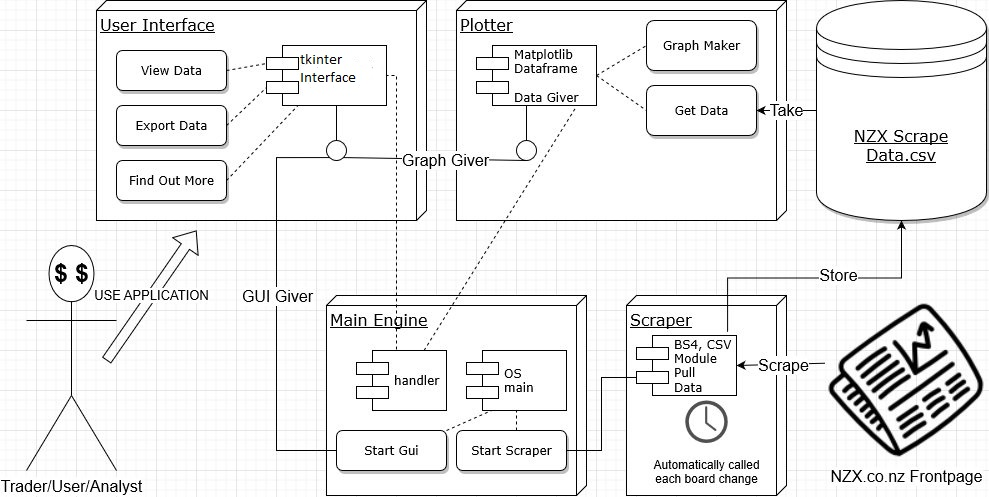

# NZX Market Trading Summary Graph
Uses web scraping via beautiful soup to generate incremental data and graph daily trading volume and value over a time series for both the Stock Market (NZSX) and Debt Market (NZDX)

High level architecture: 

